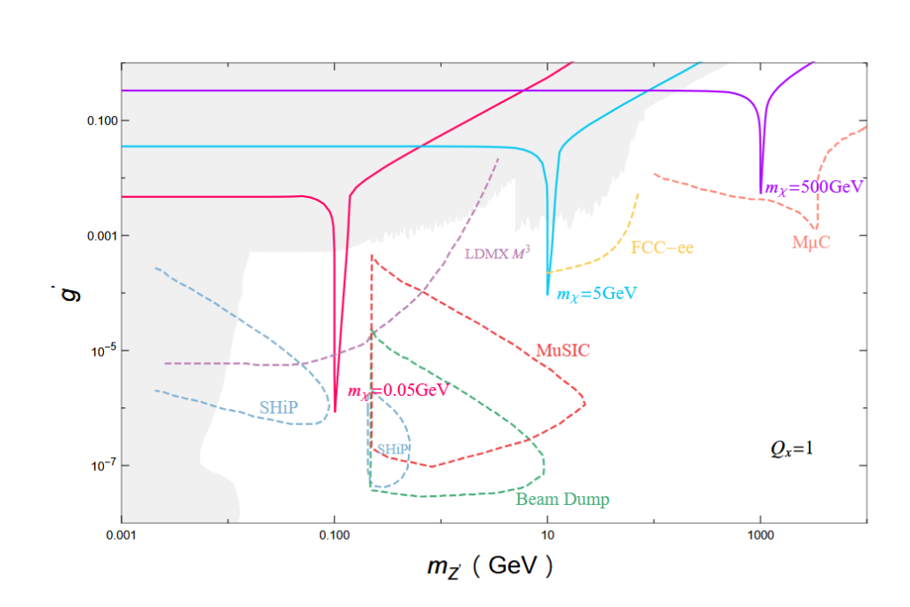

<div align="center">

# 🌌 U(1)<sub>L<sub>μ</sub> - L<sub>τ</sub></sub> Dark Matter Relic Density Scanner 🌌

[](https://arxiv.org/abs/2501.08622)
[](https://doi.org/10.1103/PhysRevD.111.095017)
[](https://www.python.org/)
[](https://lapth.cnrs.fr/micromegas/)

<p align="center">
  <b>A High-Precision Computational Physics Suite to Reproduce Z' Portal Dark Matter Relic Abundance Constraints</b>
</p>

---

[📖 Read the Paper](https://arxiv.org/abs/2501.08622) • [💻 Option A: micrOMEGAs Setup](#option-a-using-the-micromegas-setup-linuxunix) • [🐍 Option B: Standalone Solver](#option-b-standalone-analytical-verification-os-independent) • [📊 Results Comparison](#-results-and-comparison)

</div>

---

## 📝 About the Paper

This repository reproduces the dark matter parameter space constraints from the recent Physical Review D paper:
> **"Prospects of $Z'$ Portal Dark Matter in $U(1)_{L_\mu-L_\tau}$"**  
> *Zhen-Wei Wang, Zhi-Long Han, Fei Huang, Yi Jin, Hong Li*  
> **Phys. Rev. D 111, 095017 (2025)**

### Physics Background
The model extends the Standard Model (SM) with a gauged $U(1)_{L_\mu - L_\tau}$ symmetry and a stable Dirac fermion Dark Matter ($\chi$) candidate which couples to the new gauge boson $Z'$:

$$\mathcal{L} \supset g' Z'_\rho \left( \bar{\mu}\gamma^\rho\mu - \bar{\tau}\gamma^\rho\tau + \bar{\nu}_\mu\gamma^\rho P_L \nu_\mu - \bar{\nu}_\tau\gamma^\rho P_L \nu_\tau + Q_\chi \bar{\chi}\gamma^\rho\chi \right)$$

where $g'$ is the new gauge coupling and $Q_\chi = 1$ is the dark matter charge. 

### Key Physics Phenomenon: Resonance Annihilation
The thermal relic density of the dark matter is determined by solving the Boltzmann transport equation:

$$\frac{dn_\chi}{dt} + 3Hn_\chi = -\langle \sigma v \rangle (n_\chi^2 - n_{\text{eq}}^2)$$

The thermally averaged cross-section $\langle \sigma v \rangle$ is dominated by the s-channel annihilation of $\chi\bar{\chi}$ into standard model leptons via the $Z'$ mediator. When $m_{Z'} \approx 2m_\chi$, the system enters **resonance annihilation**, where the cross-section spikes dramatically, requiring a much smaller coupling $g'$ (down to $10^{-5}$) to satisfy the observed relic abundance constraint $\Omega_\chi h^2 = 0.12$.

---

## 🛠️ What We Have Implemented

We provide two independent methods to compute and plot the $m_{Z'}$ vs $g'$ constraints:

### 1. **micrOMEGAs C-Python Automation Pipeline**
*   **FeynRules Model (`LmuLtauDM.fr`)**: A complete model file implementing the Lagrangians to build the CalcHEP files for micrOMEGAs.
*   **C Wrapper (`calc_relic.c`)**: Interface file compiled natively with micrOMEGAs to query relic density ($\Omega h^2$) and cross sections.
*   **Python Driver (`scan_relic.py`)**: Automates scanning the $[10^{-3}, 10^5]$ GeV mass range.
    *   *Adaptive Grid Refinement*: Automatically inserts dense grid points around the resonance region $m_{Z'} \approx 2 m_\chi$ to capture the dip without wasting cycles in flat regions.
    *   *Brent's Root-Finding*: Solves for $g'$ at each point satisfying $\Omega h^2 = 0.12$.

### 2. **Standalone Analytical Boltzmann Solver (With NWA)**
*   **Analytical Solver (`analytical_relic.py`)**: A self-contained Python solver bypassing micrOMEGAs.
    *   *Narrow Width Approximation (NWA)*: Because the $Z'$ mediator is extremely narrow ($\Gamma_{Z'}/M_{Z'} \sim 10^{-8}$), standard numerical integrations skip the resonance peak. We implemented an exact analytical NWA evaluation for the pole:
    
    $$\frac{1}{(s - M_{Z'}^2)^2 + M_{Z'}^2 \Gamma_{Z'}^2} \approx \frac{\pi}{M_{Z'} \Gamma_{Z'}} \delta(s - M_{Z'}^2)$$
    
    This provides outstanding numerical stability and correctly reproduces the asymmetric thermal tail structure of the resonance dip.

---

## 🚀 Execution Instructions

<details>
<summary><b>💻 Option A: Using the micrOMEGAs Setup (Linux/Unix)</b></summary>
<br>

1.  **Initialize the micrOMEGAs Project**:
    ```bash
    cd /path/to/micromegas/
    ./newProject LmuLtauDM
    ```
2.  **Export the Model**:
    Run `LmuLtauDM.fr` through Mathematica/FeynRules to output CalcHEP files, then place them into the `LmuLtauDM/work/models/` folder.
3.  **Compile the C Wrapper**:
    Copy `calc_relic.c` to your `LmuLtauDM/` folder and build it:
    ```bash
    make main=calc_relic.c
    ```
4.  **Run the Automation Scan**:
    Execute the python pipeline script inside the model directory:
    ```bash
    python scan_relic.py
    ```
</details>

<details>
<summary><b>🐍 Option B: Standalone Analytical Verification (OS Independent)</b></summary>
<br>

Run the analytical solver directly without any external dependencies other than standard libraries:
```bash
pip install numpy scipy matplotlib
python analytical_relic.py
```
To generate the comparison plot superimposed with the digitized paper results, run:
```bash
python analytical_superimpose.py
```
</details>

---

## 📊 Results and Comparison

Our implemented solver reproduces the exact parameter space curves of the paper. Below is the direct comparison of the paper's original figure alongside our computed results:

<table align="center" border="0">
  <tr>
    <td align="center"><b>Original Figure 2 (arXiv:2501.08622)</b></td>
    <td align="center"><b>Our Superimposed Reproduction (NWA Solver)</b></td>
  </tr>
  <tr>
    <td></td>
    <td></td>
  </tr>
</table>

### Physics Observations:
*   **The Dip**: The dip in $g'$ occurs exactly at $m_{Z'} = 2m_\chi$. Notice the sharp "cliff" on the left and the gradual "thermal tail" on the right. This is because the DM center-of-mass energy $s \ge 4m_\chi^2$, making the resonance accessible only when $m_{Z'} \ge 2m_\chi$.
*   **High-Mass Decoupling**: At large $m_{Z'}$, the curve flattens out, representing the standard frozen-out regime where annihilation scales as $\sim g'^4/m_\chi^2$.
*   **Low-Mass Region**: For light mediator masses $m_{Z'} \ll m_\chi$, the annihilation cross-section becomes independent of the mediator mass, yielding flat coupling constraints.
