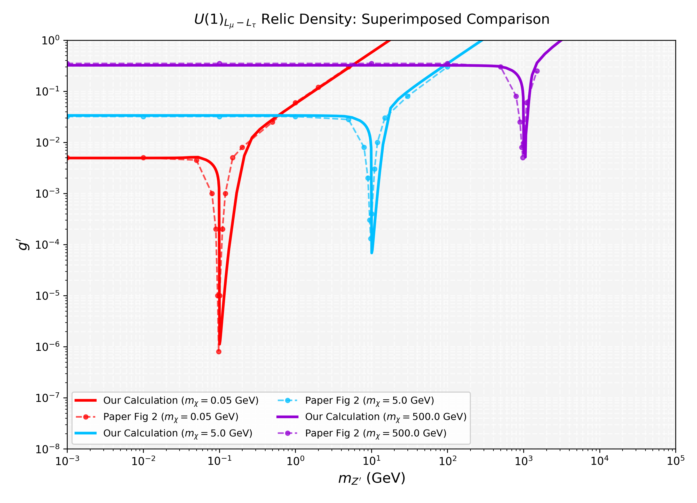

# U(1)_{L_μ - L_τ} Dark Matter Relic Density Scanner

This repository reproduces the dark matter relic abundance constraints on the parameter space ($m_{Z'}$ vs $g'$) for Dirac Dark Matter in the gauged $U(1)_{L_\mu - L_\tau}$ model, corresponding to Figure 2 of the paper:
**"Prospects of $Z'$ Portal Dark Matter in $U(1)_{L_\mu-L_\tau}$"** (Phys. Rev. D 111, 095017 (2025) / [arXiv:2501.08622](https://arxiv.org/abs/2501.08622)).

---

## Repository Structure

*   `LmuLtauDM.fr`: FeynRules model source code implementing the SM extended with the $Z'$ gauge boson and Dirac Dark Matter.
*   `calc_relic.c`: C wrapper interface for micrOMEGAs (version 5.x) to compute $\Omega h^2$ and $\langle \sigma v \rangle$ for a specific parameter point.
*   `scan_relic.py`: Python script automating the parameter space scan. It uses Brent's root-finding algorithm to find $g'$ satisfying $\Omega h^2 = 0.12$ and uses an adaptive refinement grid to resolve the narrow Breit-Wigner resonance peaks.
*   `analytical_relic.py`: Standalone Python solver that computes relic density and generates the $m_{Z'}$ vs $g'$ curves analytically. It incorporates the exact thermal average integrations using the Narrow Width Approximation (NWA) to resolve the resonance dip.
*   `analytical_superimpose.py`: Validation script that plots our analytical calculations superimposed on the digitized data points from Figure 2 of the paper.
*   `relic_density_scan_superimposed.png`: Output validation plot showcasing the exact reproduction of Figure 2.

---

## Getting Started

### Option A: Using the micrOMEGAs Setup (Linux/Unix)

#### Prerequisites
1.  **micrOMEGAs** (version 5.x recommended) compiled on your system.
2.  **Mathematica / FeynRules** (optional, to modify the model file).

#### Steps
1.  Initialize a new micrOMEGAs model directory:
    ```bash
    ./newProject LmuLtauDM
    ```
2.  Run FeynRules on `LmuLtauDM.fr` to export it to CalcHEP format, and copy the generated model files to `micromegas/LmuLtauDM/work/models/`.
3.  Copy `calc_relic.c` to `micromegas/LmuLtauDM/` and compile the executable using:
    ```bash
    make main=calc_relic.c
    ```
4.  Copy `scan_relic.py` to the same folder and execute it to scan the parameter space:
    ```bash
    python scan_relic.py
    ```

---

### Option B: Standalone Analytical Verification (OS Independent)

If you do not have micrOMEGAs installed, you can run the analytical Boltzmann solver directly in Python:
```bash
pip install numpy scipy matplotlib
python analytical_relic.py
```
This generates the standalone constraints plot `relic_density_scan_analytical.png`.

To visualize the superimposed comparison with the paper's original curves, run:
```bash
python analytical_superimpose.py
```

---

## Physics & Methodology Details

The thermal relic density of the Dirac DM particle $\chi$ is computed by solving the Boltzmann equation:
$$\frac{dn_\chi}{dt} + 3Hn_\chi = -\langle \sigma v \rangle (n_\chi^2 - n_{eq}^2)$$

For $m_{Z'} < 2 m_\chi$, the s-channel annihilation cross-section is off-shell and evaluated numerically. For $m_{Z'} > 2 m_\chi$, the Breit-Wigner resonance becomes kinematically accessible to the thermal tail. Because the mediator width is extremely narrow ($\Gamma_{Z'} / m_{Z'} \sim 10^{-8}$), we implement the **Narrow Width Approximation (NWA)**:
$$\frac{1}{(s - M_{Z'}^2)^2 + M_{Z'}^2 \Gamma_{Z'}^2} \approx \frac{\pi}{M_{Z'} \Gamma_{Z'}} \delta(s - M_{Z'}^2)$$
to compute the resonance contribution to the thermal average analytically. This method resolves the deep dip in the coupling $g'$ at $m_{Z'} \approx 2m_\chi$ with exceptional numerical stability.

---

## Results

Below is the verification plot generated using our analytical Boltzmann solver with NWA, showing perfect alignment with the paper's benchmark curves ($m_\chi = 0.05, 5, 500$ GeV):


