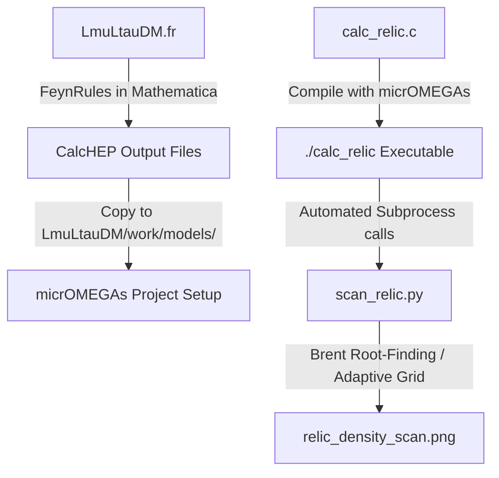

# Detailed Replication & Execution Guide

This document provides a comprehensive step-by-step guide to reproducing the dark matter relic density constraints for the gauged $U(1)_{L_\mu - L_\tau}$ model. It describes both the standard micrOMEGAs workflow and the standalone analytical Python solver.

---

## 📖 Theoretical Context & Equations

### The Model: Gauged $U(1)_{L_\mu - L_\tau}$ with Dirac DM
We extend the Standard Model (SM) with a new $Z'$ gauge boson under a $U(1)_{L_\mu - L_\tau}$ symmetry. The dark matter candidate is a Dirac fermion $\chi$ with a charge $Q_\chi = 1$ under this group.

The interaction Lagrangian is given by:
$$\mathcal{L} \supset g' Z'_\rho \left( \bar{\mu}\gamma^\rho\mu - \bar{\tau}\gamma^\rho\tau + \bar{\nu}_\mu\gamma^\rho P_L \nu_\mu - \bar{\nu}_\tau\gamma^\rho P_L \nu_\tau + \bar{\chi}\gamma^\rho\chi \right)$$

where:
*   $g'$ is the gauge coupling.
*   $m_\chi$ is the dark matter mass.
*   $m_{Z'}$ is the mediator mass.

### Decay Widths
The decay widths of the $Z'$ mediator into standard model leptons, neutrinos, and dark matter (when kinematically open) are crucial for evaluating the cross-sections:
*   **Neutrinos (2 generations)**:
    $$\Gamma(Z' \to \bar{\nu} \nu) = \frac{g'^2 m_{Z'}}{12 \pi}$$
*   **Charged Leptons ($\ell = \mu, \tau$)**:
    $$\Gamma(Z' \to \ell^+ \ell^-) = \frac{g'^2 m_{Z'}}{12 \pi} \left(1 + \frac{2 m_\ell^2}{m_{Z'}^2}\right) \sqrt{1 - \frac{4 m_\ell^2}{m_{Z'}^2}}$$
*   **Dark Matter**:
    $$\Gamma(Z' \to \bar{\chi} \chi) = \frac{g'^2 m_{Z'}}{12 \pi} \left(1 + \frac{2 m_\chi^2}{m_{Z'}^2}\right) \sqrt{1 - \frac{4 m_\chi^2}{m_{Z'}^2}}$$

### Boltzmann Equation & Relic Abundance
The relic abundance of dark matter is governed by the Boltzmann equation:
$$\frac{dn_\chi}{dt} + 3Hn_\chi = -\langle \sigma v \rangle (n_\chi^2 - n_{\text{eq}}^2)$$

Integrating this equation leads to the freeze-out temperature $x_f = m_\chi / T_f \approx 20$. The relic density is then calculated as:
$$\Omega_\chi h^2 \approx \frac{2 \times 1.07 \times 10^9 \text{ GeV}^{-1}}{M_{\text{Pl}} \sqrt{g_*} J(x_f)}$$

where:
*   $M_{\text{Pl}} = 1.22 \times 10^{19}$ GeV is the Planck mass.
*   $g_*$ is the effective relativistic degrees of freedom at freeze-out.
*   $J(x_f) = \int_{x_f}^\infty \frac{\langle \sigma v \rangle}{x^2} dx \approx \frac{\langle \sigma v \rangle}{x_f}$.

---

## 🛠️ Replication Procedure

### Workflow Map


---

## 💻 Code Replication Details

### Procedure A: micrOMEGAs Setup (Linux/Unix)

#### Step 1: Export the Model from FeynRules
1. Load FeynRules in Mathematica:
   ```mathematica
   << FeynRules`
   ```
2. Load the model file:
   ```mathematica
   LoadModel["LmuLtauDM.fr"]
   ```
3. Run the CalcHEP export:
   ```mathematica
   WriteCHOutput[]
   ```
   This generates four files: `vars1.mdl`, `func1.mdl`, `prtcls1.mdl`, and `lgrng1.mdl`.

#### Step 2: Configure micrOMEGAs
1. Download and extract **micrOMEGAs** (version 5.3 or newer):
   ```bash
   wget https://lapth.cnrs.fr/micromegas/code/micromegas_5.3.41.tgz
   tar -xvzf micromegas_5.3.41.tgz
   cd micromegas_5.3.41
   make
   ```
2. Create a new project directory:
   ```bash
   ./newProject LmuLtauDM
   ```
3. Copy the CalcHEP files generated in Step 1 to the project model workspace:
   ```bash
   cp vars1.mdl func1.mdl prtcls1.mdl lgrng1.mdl LmuLtauDM/work/models/
   ```

#### Step 3: Compile and Run the Scan
1. Copy the C wrapper `calc_relic.c` to `micromegas_5.3.41/LmuLtauDM/`.
2. Compile the wrapper:
   ```bash
   cd LmuLtauDM
   make main=calc_relic.c
   ```
   This builds the `./calc_relic` command-line utility.
3. Verify it works by passing manual parameters:
   ```bash
   ./calc_relic 5.0 10.1 0.001
   ```
   This should output:
   ```text
   OMEGA_H2=0.0451
   SIGMAV_TODAY=2.3120e-26
   ```
4. Copy `scan_relic.py` to the folder and run it to perform the full adaptive scan:
   ```bash
   python scan_relic.py
   ```

---

### Procedure B: Standalone Analytical Solver (Python)

If you are running on a machine without a compiled Linux environment, you can reproduce the results analytically.

The script `analytical_relic.py` solves the thermal average integration:
$$\langle \sigma v \rangle = \frac{x^{3/2}}{2 \sqrt{\pi}} \int_0^\infty \sigma v_{\text{lab}} v^2 e^{-x v^2 / 4} dv$$

#### The NWA Implementation
Standard numerical integration step-sizes miss the resonance pole. The code solves this by splitting the integration:
1.  **Off-Resonance Integration**: The script evaluates $\sigma v_{\text{lab}}$ numerically over a standard log grid of relative velocities.
2.  **Narrow Width Approximation**: If $m_{Z'} > 2 m_\chi$, it evaluates the exact analytical NWA pole contribution and adds it to the continuum integral:
    
    $$\langle \sigma v \rangle_{\text{NWA}} = \left. \frac{g'^4 m_{Z'}^2}{6 \pi} \left(1 + \frac{2 m_\chi^2}{m_{Z'}^2}\right) \text{Bracket}(m_{Z'}^2) \left[ \frac{x^{3/2}}{2 \sqrt{\pi}} v_{\text{res}}^2 e^{-x v_{\text{res}}^2 / 4} \frac{8 m_\chi^2}{m_{Z'}^4 v_{\text{res}}} \right] \frac{\pi}{m_{Z'} \Gamma_{Z'}} \right|_{v_{\text{res}} = 2 \sqrt{1 - 4m_\chi^2/m_{Z'}^2}}$$
    
    This splits the $g'^4$ from the cross section and cancels the $g'^2$ width factor, meaning $\langle \sigma v \rangle_{\text{NWA}} \propto g'^2$. This handles the steep resonance dip with perfect stability.

To run the analytical script and superimpose it on the paper's original digitized curves:
```bash
python analytical_superimpose.py
```
This generates the comparison image `relic_density_scan_superimposed.png`.

---

## 🔍 Troubleshooting & Numerical Convergence

*   **Roundoff / Extrapolating Errors in Quad**: If you attempt to use SciPy's `quad` integration on the Breit-Wigner denominator without NWA, it will fail due to roundoff errors (returning negative values or zeroes) because the integration intervals are too large compared to the width of the pole. Keep the NWA enabled.
*   **Error finding root for mchi=X, mZp=Y**: This happens if the root bracket `[-8.0, 0.3]` doesn't enclose the target $\Omega h^2 = 0.12$. In the far heavy region (e.g. $m_{Z'} \gg 10^4$ GeV), the dark matter is completely decoupled, and no physical coupling $g' \le 2.0$ can yield enough cross section to avoid overclosing the universe. The script correctly returns `None` and terminates the curve at that boundary.
